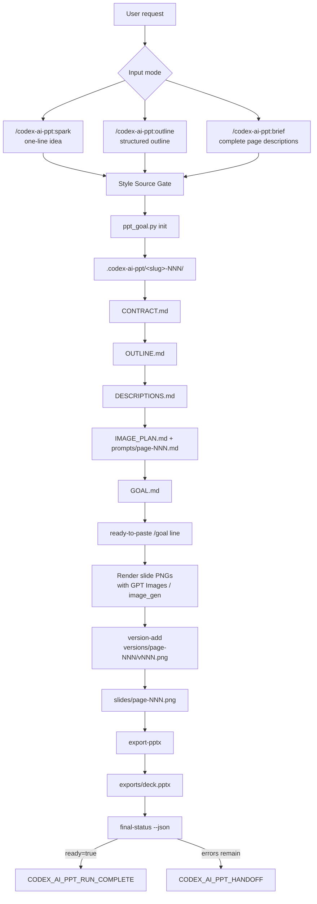

# codex-ai-ppt

### Review-gated image-based PPT generation for Codex


## What codex-ai-ppt Is

codex-ai-ppt is a Codex plugin for producing image-based PowerPoint decks through a staged, reviewable workflow. It turns a topic, structured outline, or complete page brief into confirmed generation artifacts, then hands execution to `/goal` for GPT Images slide rendering and PPTX export.

The plugin is intentionally not a one-shot "make slides" prompt. It creates a local `.codex-ai-ppt/<slug>-NNN/` run directory with durable intermediate files such as `CONTRACT.md`, `OUTLINE.md`, `DESCRIPTIONS.md`, `IMAGE_PLAN.md`, `GOAL.md`, `STATE.json`, per-page prompts, rendered slide PNGs, version history, exported `deck.pptx`, and final status reports.

The public project name and Codex plugin package name are both `codex-ai-ppt`.

## The Problem

AI-generated PPT workflows tend to fail in predictable ways:

- A vague topic becomes a deck before the user has approved audience, style, scope, or page count.
- Generated outlines silently drift away from the user's original structure.
- Slide text, visual prompts, and final images get mixed into one unreviewable transcript.
- Style is guessed when the user actually wanted a template image or a specific written visual direction.
- PPT export can happen even when some slide images are missing, stale, or partial.
- Revisions are hard to track because generated images overwrite prior attempts.

## Core Idea

codex-ai-ppt separates planning, confirmation, image generation, versioning, and export:

1. The user starts from one of three modes: `spark`, `outline`, or `brief`.
2. A Style Source Gate forces the user to choose either a template image or a written style description.
3. The plugin initializes a local run directory and records state in `STATE.json`.
4. The user explicitly approves each stage before downstream artifacts are treated as final.
5. `GOAL.md` becomes the executor contract for `/goal`.
6. The executor renders each full slide as a PNG through Codex GPT Images or built-in `image_gen`.
7. Every chosen PNG is recorded as a version and copied into the active `slides/` directory.
8. `export-pptx` creates an image-only PowerPoint where each slide contains one full-slide PNG.
9. `final-status --json` is the completion gate; the run is complete only when `ready=true`.



## Design Philosophy

codex-ai-ppt is built around explicit principle/mechanism pairs.

| Principle | Mechanism |
| --- | --- |
| Confirmation before generation | Style, contract, outline, descriptions, and image plan are gated by explicit user approval. Silence is never approval. |
| Style source is a first-class choice | Every run must use either `template_image` or `style_description`; the plugin does not invent a default visual direction. |
| Artifacts over transcript memory | The run directory stores confirmed Markdown artifacts, prompts, state, events, images, exports, and reports. |
| Preserve user structure | `outline` mode parses the user's outline without silently rewriting, expanding, or improving it. |
| Brief means brief | `brief` mode treats user-provided page descriptions as source material and skips normal outline invention. |
| Full-slide images by design | The exported deck is image-only: each PowerPoint slide contains exactly one full-slide PNG. |
| Versioned image selection | `version-add` records generated image attempts under `versions/` and copies the active choice to `slides/`. |
| Completion proof over self-report | `final-status --json` validates style source, descriptions, image plan, images, and export before declaring readiness. |

## Modes

| Mode | Trigger | Best for | Behavior |
| --- | --- | --- | --- |
| Spark | `/codex-ai-ppt:spark` | A topic, idea, audience goal, or one-sentence brief | Generates a project contract, outline, page descriptions, image plan, prompts, and `/goal` handoff. |
| Outline | `/codex-ai-ppt:outline` | Existing headings, bullets, or a structured slide plan | Preserves the user's outline, parses stable slide IDs, then creates descriptions, prompts, and handoff artifacts. |
| Brief | `/codex-ai-ppt:brief` | Complete per-page slide descriptions | Uses the user's page descriptions directly, reverse-extracts a lightweight outline, then creates prompts and handoff artifacts. |

The slash-style prefixes are user-facing trigger aliases. The actual skill directories are `spark`, `outline`, and `brief`.

## Feature Map

| Feature | Where it lives | Purpose |
| --- | --- | --- |
| Plugin manifest | `.codex-plugin/plugin.json` | Defines the Codex plugin metadata, display name, skills path, and default prompts. |
| Spark skill | `skills/spark/SKILL.md` | Initializes a run from a one-line idea or topic. |
| Outline skill | `skills/outline/SKILL.md` | Initializes a run from structured outline material while preserving user wording. |
| Brief skill | `skills/brief/SKILL.md` | Initializes a run from complete page descriptions. |
| Shared workflow reference | `references/codex-ai-ppt-workflow.md` | Defines run directory shape, CLI commands, state machine, `/goal` handoff, export, and validation. |
| Style gate | `references/style-source-gate.md` | Requires `template_image` or `style_description` before artifact generation. |
| Confirmation gates | `references/confirmation-gates.md` | Defines the approval checkpoints for each mode. |
| Prompt patterns | `references/prompt-patterns.md` | Guides how slide descriptions and image prompts should be written. |
| CLI | `scripts/ppt_goal.py` | Owns run initialization, state updates, validation, image versioning, export, and final status. |
| Convenience wrapper | `bin/codex-ai-ppt` | Runs the Python CLI without typing the script path. |
| PPTX exporter | `scripts/export_pptx_artifact.mjs` | Preferred export path through Codex's bundled `@oai/artifact-tool`. |
| Templates | `templates/*.md` | Source templates for contract, outline, descriptions, image plan, and executor goal. |
| Tests | `tests/test_ppt_goal.py` | Unit and smoke tests for CLI behavior and export readiness. |

## How A Run Progresses

The default flow is deliberately staged:

1. Choose an input mode: `spark`, `outline`, or `brief`.
2. Pass the Style Source Gate with either a readable template image or a written style description.
3. Initialize a run under the caller's project, not inside the plugin directory.
4. Confirm `CONTRACT.md`.
5. Confirm `OUTLINE.md` when the mode uses or extracts an outline.
6. Confirm `DESCRIPTIONS.md`; rendered text in this file is final slide text, not commentary.
7. Confirm `IMAGE_PLAN.md` and per-page prompt files.
8. Write `GOAL.md` and output exactly one ready-to-paste `/goal` command.
9. `/goal` renders each page as a full-slide PNG and records it with `version-add`.
10. Export the final deck with `export-pptx`.
11. Finish only when `final-status --json` returns `ready=true`.

## Run Directory

A typical run looks like this:

```text
.codex-ai-ppt/<slug>-NNN/
  CONTRACT.md
  OUTLINE.md
  DESCRIPTIONS.md
  IMAGE_PLAN.md
  GOAL.md
  STATE.json
  references/template.png
  prompts/page-001.md
  slides/page-001.png
  versions/page-001/v001.png
  exports/deck.pptx
  events.jsonl
  reports/final.md
```

`STATE.json` and `events.jsonl` make the run inspectable and resumable. The generated Markdown files are review surfaces. `slides/` contains active final slide images. `versions/` keeps prior generated attempts.

## State Machine

Project status:

```text
draft -> style_source_confirmed -> contract_confirmed -> outline_confirmed -> descriptions_confirmed -> image_plan_confirmed -> ready_for_goal -> generating_images -> exported -> completed
```

Page status:

```text
planned -> description_ready -> prompt_ready -> queued -> image_generated -> exported
```

`brief` mode can move from contract confirmation directly to confirmed descriptions, but it still maintains a lightweight `OUTLINE.md` for prompt context.

## CLI

The stable CLI entry is:

```bash
python3 /Users/hola/Desktop/aippt/plugins/codex-ai-ppt/scripts/ppt_goal.py <command>
```

`bin/codex-ai-ppt` is a convenience wrapper when called from the plugin checkout:

```bash
plugins/codex-ai-ppt/bin/codex-ai-ppt status --run .codex-ai-ppt/demo-001 --json
```

Stable commands:

```bash
python3 /Users/hola/Desktop/aippt/plugins/codex-ai-ppt/scripts/ppt_goal.py init --run <run-dir> --mode spark|outline|brief --title <title> --aspect 16:9 --language auto --style-source template_image|style_description
python3 /Users/hola/Desktop/aippt/plugins/codex-ai-ppt/scripts/ppt_goal.py status --run <run-dir> --json
python3 /Users/hola/Desktop/aippt/plugins/codex-ai-ppt/scripts/ppt_goal.py write-artifact --run <run-dir> --stage contract|outline|descriptions|image-plan --stdin
python3 /Users/hola/Desktop/aippt/plugins/codex-ai-ppt/scripts/ppt_goal.py validate --run <run-dir> --stage contract|outline|descriptions|image-plan|images|export
python3 /Users/hola/Desktop/aippt/plugins/codex-ai-ppt/scripts/ppt_goal.py validate-style-source --run <run-dir>
python3 /Users/hola/Desktop/aippt/plugins/codex-ai-ppt/scripts/ppt_goal.py smart-merge-outline --run <run-dir> --stdin
python3 /Users/hola/Desktop/aippt/plugins/codex-ai-ppt/scripts/ppt_goal.py version-add --run <run-dir> --page <slide-id> --image <png-path> --prompt <prompt-path>
python3 /Users/hola/Desktop/aippt/plugins/codex-ai-ppt/scripts/ppt_goal.py version-activate --run <run-dir> --page <slide-id> --version <version-id>
python3 /Users/hola/Desktop/aippt/plugins/codex-ai-ppt/scripts/ppt_goal.py export-pptx --run <run-dir> --out <pptx-path>
python3 /Users/hola/Desktop/aippt/plugins/codex-ai-ppt/scripts/ppt_goal.py final-status --run <run-dir> --json
```

## Install

### CLI

```bash
codex plugin marketplace add Y4tacker/codex-ai-ppt --ref main
codex plugin add codex-ai-ppt@codex-ai-ppt
```

If you already added an older marketplace entry with the same name, remove it first, then add the remote marketplace again:

```bash
codex plugin marketplace remove codex-ai-ppt
codex plugin marketplace add Y4tacker/codex-ai-ppt --ref main
codex plugin add codex-ai-ppt@codex-ai-ppt
```

### Codex App

1. Open Codex App and go to the plugin marketplace/add marketplace entry point.
2. Enter `Y4tacker/codex-ai-ppt` as the marketplace source and add it.
3. Install `codex-ai-ppt` from the `codex-ai-ppt` marketplace.

## Usage

Start from a topic:

```text
/codex-ai-ppt:spark 做一个关于 AI 历史的 PPT，面向产品团队，8 页，科技现代风格
```

Start from a structured outline:

```text
/codex-ai-ppt:outline 根据下面大纲生成图片式 PPT，商务简约风格

# AI 产品路线图
## 背景
- 市场变化
- 用户需求
## 机会
- 场景一
- 场景二
## 计划
- 近期动作
- 风险控制
```

Start from complete page descriptions:

```text
/codex-ai-ppt:brief 使用科技现代风格，把下面页面描述直接生成 PPT

## page-001 封面
Visible text:
AI 产品路线图
2026 Strategy Review

Visual:
深色背景，中央标题，高对比光效，右侧抽象数据流。

## page-002 市场变化
Visible text:
需求从工具效率转向智能协作

Visual:
左右对比布局，左侧传统工具，右侧 AI 协作网络。
```

After the final initialization gate, the plugin emits one `/goal` line similar to:

```text
/goal "Read .codex-ai-ppt/<slug>-NNN/GOAL.md and execute it until CODEX_AI_PPT_RUN_COMPLETE appears with final-status ready=true, all confirmed slide prompts rendered through Codex GPT Images, active PNG versions recorded, deck.pptx exported, and validation clean; stop with CODEX_AI_PPT_HANDOFF on unresolved failures."
```

Paste that line into Codex to run the image rendering and export phase.

## Style Sources

Every run must choose exactly one style source.

| Style source | Use when | Stored as |
| --- | --- | --- |
| `template_image` | The user provides a PPT screenshot, template image, or visual reference image. | `references/template.png`, `.jpg`, `.jpeg`, or `.webp` |
| `style_description` | The user provides a written style such as `商务简约`, `学术正式`, `科技现代`, or a longer visual direction. | `style_source.style_description` in `STATE.json` and `CONTRACT.md` |

The plugin does not fall back to a default style. If style priority is ambiguous, the skill asks before creating downstream artifacts.

## PPTX Export

codex-ai-ppt exports image-only decks. Each slide contains one full-slide PNG, so the deck preserves the visual output produced by GPT Images instead of rebuilding layouts with PowerPoint shapes.

The preferred exporter uses Codex's bundled `@oai/artifact-tool` through:

```text
/Users/hola/.cache/codex-runtimes/codex-primary-runtime/dependencies/node
```

If that exporter is unavailable, the CLI can fall back to a minimal OOXML writer and records the fallback reason in `events.jsonl`. A fallback export is a recovery path; if it happens every time in an environment that should have `@oai/artifact-tool`, module resolution should be fixed.

## Completion Gate

Use `final-status` as the source of truth:

```bash
python3 /Users/hola/Desktop/aippt/plugins/codex-ai-ppt/scripts/ppt_goal.py final-status --run <run-dir> --json
```

The run is complete only when the payload contains:

```json
{
  "ready": true,
  "pptx": "exports/deck.pptx"
}
```

`ready=true` requires all of these checks to pass:

- style source is valid;
- `DESCRIPTIONS.md` exists and has parseable non-empty pages;
- `IMAGE_PLAN.md` exists and every page has a prompt file;
- every page has an active slide PNG in `slides/`;
- `exports/deck.pptx` exists and is a valid zip package.

## Validation

Run plugin validation, skill validation, unit tests, and a minimal CLI smoke test:

```bash
python3 /Users/hola/.codex/skills/.system/plugin-creator/scripts/validate_plugin.py \
  /Users/hola/Desktop/aippt/plugins/codex-ai-ppt

python3 /Users/hola/.codex/skills/.system/skill-creator/scripts/quick_validate.py \
  /Users/hola/Desktop/aippt/plugins/codex-ai-ppt/skills/spark

python3 /Users/hola/.codex/skills/.system/skill-creator/scripts/quick_validate.py \
  /Users/hola/Desktop/aippt/plugins/codex-ai-ppt/skills/outline

python3 /Users/hola/.codex/skills/.system/skill-creator/scripts/quick_validate.py \
  /Users/hola/Desktop/aippt/plugins/codex-ai-ppt/skills/brief

python3 -m unittest /Users/hola/Desktop/aippt/plugins/codex-ai-ppt/tests/test_ppt_goal.py
```

Minimal smoke test:

```bash
tmp="$(mktemp -d)"

python3 /Users/hola/Desktop/aippt/plugins/codex-ai-ppt/scripts/ppt_goal.py init \
  --run "$tmp/demo-001" \
  --mode spark \
  --title "AI History" \
  --aspect 16:9 \
  --language zh \
  --style-source style_description \
  --style-description "科技现代"

python3 /Users/hola/Desktop/aippt/plugins/codex-ai-ppt/scripts/ppt_goal.py validate-style-source \
  --run "$tmp/demo-001"

printf '## page-001 封面\nVisible text:\nAI 历史\n' | \
python3 /Users/hola/Desktop/aippt/plugins/codex-ai-ppt/scripts/ppt_goal.py write-artifact \
  --run "$tmp/demo-001" \
  --stage descriptions \
  --stdin

python3 /Users/hola/Desktop/aippt/plugins/codex-ai-ppt/scripts/ppt_goal.py validate \
  --run "$tmp/demo-001" \
  --stage descriptions

rm -rf "$tmp"
```

If the official validators fail with `ModuleNotFoundError: No module named 'yaml'`, the validation Python environment is missing PyYAML. That does not by itself mean the plugin manifest or skill frontmatter is invalid.

## Runtime Mapping

| Need | codex-ai-ppt implementation |
| --- | --- |
| User-facing entry points | `/codex-ai-ppt:spark`, `/codex-ai-ppt:outline`, `/codex-ai-ppt:brief` |
| Persistent run state | `.codex-ai-ppt/<slug>-NNN/STATE.json` |
| Human review surfaces | `CONTRACT.md`, `OUTLINE.md`, `DESCRIPTIONS.md`, `IMAGE_PLAN.md` |
| Executor handoff | `GOAL.md` plus one ready-to-paste `/goal` line |
| Image generation | Codex GPT Images or built-in `image_gen` during `/goal` execution |
| Image versioning | `version-add` and `version-activate` |
| Active final slide images | `slides/page-NNN.png` |
| PPTX export | `export-pptx` through artifact-tool or OOXML fallback |
| Completion decision | `final-status --json` |

## Core Concepts

| Concept | Meaning |
| --- | --- |
| Run | One local deck-generation workspace under `.codex-ai-ppt/<slug>-NNN/`. |
| Contract | Confirmed project scope: title, audience, language, aspect, page count, style source, and source material. |
| Style Source | Either a template image or a written visual style description. |
| Outline | Stable slide IDs, titles, and structure used for downstream page descriptions. |
| Descriptions | Final per-slide text and visual instructions. |
| Image Plan | Per-page rendering plan plus prompt-file mapping. |
| Prompt | The final page-specific instruction used for generating a full-slide PNG. |
| Version | A recorded generated PNG attempt for one page. |
| Active Image | The selected PNG copied to `slides/page-NNN.png`. |
| Export | The image-only PowerPoint deck at `exports/deck.pptx`. |
| Final Status | Validation payload that decides whether completion is real. |

## Project Status

| Field | Value |
| --- | --- |
| Public project name | `codex-ai-ppt` |
| Internal plugin name | `codex-ai-ppt` |
| Version | `0.1.0` |
| Runtime | Codex plugin plus local Python CLI |
| Primary output | Image-based `.pptx` deck |
| Supported modes | `spark`, `outline`, `brief` |
| Supported aspects | `16:9`, `4:3`, `1:1` |
| Supported languages | `auto`, `zh`, `en`, `ja` |
| Style sources | `template_image`, `style_description` |
| Marketplace name | `codex-ai-ppt` |
| License | Not declared in the current repository |

## Requirements

- Codex with plugin support.
- `python3` on `PATH`.
- Node.js for the preferred `@oai/artifact-tool` PPTX export path.
- Codex bundled runtime for artifact-tool export, or CLI fallback export support.
- Codex GPT Images or built-in `image_gen` during the `/goal` execution phase.
- macOS or Linux preferred.

## Current Boundaries

- The plugin prepares confirmed generation artifacts; it does not render final slide images during initialization.
- `/goal` execution is required for GPT Images rendering and final export.
- The output is intentionally image-based, not editable PowerPoint text and shape layers.
- If a copyable generated PNG path cannot be found, the executor must stop with `CODEX_AI_PPT_HANDOFF` instead of exporting a partial deck.
- The plugin uses local run directories; generated deck artifacts should not be written into the plugin installation directory.
